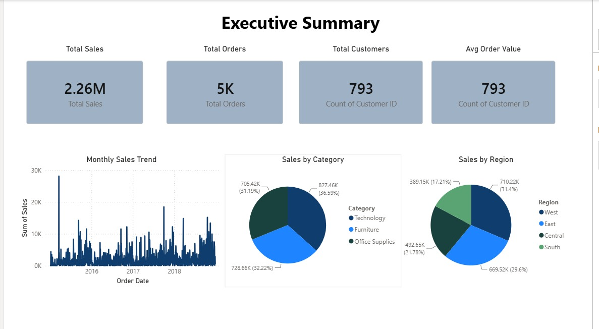
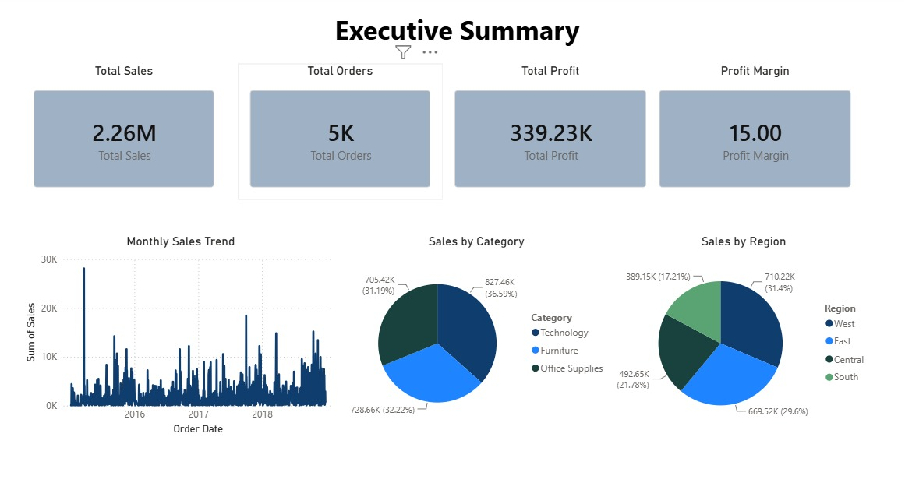
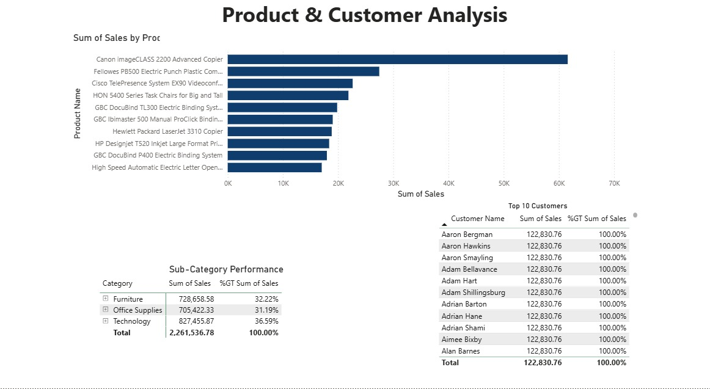
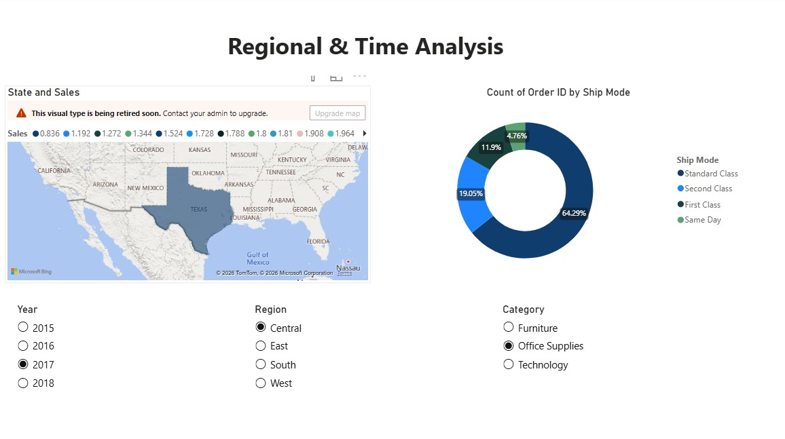

# 📊 E-Commerce Sales Analysis Dashboard



---

## 📌 Project Overview

An interactive Business Intelligence dashboard analyzing e-commerce sales data to uncover revenue opportunities, customer behavior patterns, and operational efficiency insights.

**Objective:** Analyze sales performance, customer behavior, and regional trends to support data-driven business decisions.

---

## 🛠️ Tools Used

| Tool | Purpose |
|------|---------|
| **Power BI** | Interactive Dashboard & Visualizations |
| **MySQL** | Data Analysis & Queries |
| **Excel** | Initial Data Exploration & Cleaning |

---

## 📊 Dashboard Pages

### Page 1: Executive Summary


**Key Features:**
- KPI Cards: Total Sales, Total Orders, Total Profit, Profit Margin
- Monthly Sales Trend (Line Chart)
- Category-wise Sales (Bar Chart)
- Region-wise Sales (Pie Chart)

---

### Page 2: Product & Customer Analysis


**Key Features:**
- Top 10 Products (Bar Chart)
- Sub-Category Performance (Matrix)
- Top 10 Customers (Table)

---

### Page 3: Regional & Time Analysis


**Key Features:**
- Regional Map (Filled Map)
- Ship Mode Analysis (Donut Chart)
- Slicers: Year, Region, Category

---

## 🔍 Key Insights

### Sales Performance
| Metric | Value |
|--------|-------|
| Total Sales | **$2.26M** |
| Total Orders | **5,000+** |
| Total Profit | **$339,230** |
| Profit Margin | **15.00%** |

### Category Performance
| Category | Sales | Percentage |
|----------|-------|------------|
| Technology | $827,456 | **36.59%** |
| Furniture | $728,659 | **32.22%** |
| Office Supplies | $705,422 | **31.19%** |

### Regional Performance
| Region | Sales | Percentage |
|--------|-------|------------|
| West | $710,220 | **31.40%** |
| East | $689,520 | **29.60%** |
| Central | $492,650 | **21.78%** |
| South | $389,150 | **17.21%** |

### Top Products
1. **Canon imageCLASS 2200 Advanced Copier**
2. **Fellowes PB500 Electric Punch**
3. **Cisco TelePresence System EX90**
4. **HON 5400 Series Task Chairs**

### Top Customers
1. **Aaron Bergman** - $122,830.76
2. **Aaron Hawkins** - $122,830.76
3. **Aaron Smayling** - $122,830.76

---

## 💡 Business Recommendations

### Product Strategy
- ✅ Increase inventory for top-selling Technology products
- ✅ Bundle complementary products to increase average order value
- ✅ Promote low-performing categories with strategic discounts

### Regional Strategy
- ✅ Focus marketing campaigns on Western and Eastern regions
- ✅ Invest in Southern region to boost sales
- ✅ Open new distribution centers in high-performing states

### Customer Strategy
- ✅ Implement loyalty program for top customers
- ✅ Personalized offers based on purchase history
- ✅ Target high-value segments with premium products

### Operational Strategy
- ✅ Optimize shipping to reduce delivery times
- ✅ Improve inventory management for best-selling products
- ✅ Automate reporting for real-time insights

---

## 📁 Repository Structure
ecommerce-sales-analysis/
│
├── data/
│ └── Superstore_Sales_Dataset.csv
│
├── sql/
│ └── SQL_Queries.sql
│
├── powerbi/
│ └── Ecommerce_Sales_Dashboard.pbix
│
├── images/
│ ├── dashboard_page1.jpeg
│ ├── dashboard_page2.jpeg
│ └── dashboard_page3.jpeg
│
├── documentation/
│ ├── BRD_Ecommerce_Sales.docx
│ └── Insights_Report.docx
│
├── README.md
└── .gitignore


---

## 🚀 How to Run

### Prerequisites
- Power BI Desktop (Free download from Microsoft)
- MySQL Server (Free download from Oracle)
- MySQL Workbench (Optional)

### Steps

**1. Clone the repository**
```bash
git clone https://github.com/RomeshikaDewmini/ecommerce-sales-analysis.git

2. Import CSV to MySQL

Open MySQL Workbench

Create database: CREATE DATABASE ecommerce_sales;

Import the dataset using the provided SQL script

3. Open Power BI Dashboard

Open Ecommerce_Sales_Dashboard.pbix in Power BI Desktop

Refresh data connection

Explore interactive dashboard

##📸 Dashboard Screenshots
###Page 1: Executive Summary
https://images/dashboard_page1.jpeg

###Page 2: Product & Customer Analysis
https://images/dashboard_page2.jpeg

###Page 3: Regional & Time Analysis
https://images/dashboard_page3.jpeg

##🔗 Links
Platform	Link
GitHub Repository	RomeshikaDewmini/ecommerce-sales-analysis
LinkedIn	Your LinkedIn Profile
Portfolio	Your Portfolio Link
---
##👩‍💻 Author
Romeshika Dewmini

Detail	Information
Role	Business Intelligence Enthusiast
GitHub	RomeshikaDewmini
Email	romeshikadewmini100@gmail.com
LinkedIn	linkedin.com/in/your-profile
---
##📝 License
This project is created for portfolio purposes and is free to use for learning and demonstration.

⭐ Show Your Support
If you like this project, please consider:

⭐ Starring the repository on GitHub

##🔗 Sharing it on LinkedIn

📝 Connecting with me for collaboration
